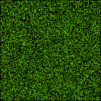
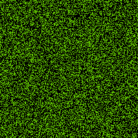

```{r setup, include=FALSE}
knitr::opts_chunk$set(echo = TRUE, cache = FALSE)
library(caTools)
```

In this post I am going to look at how we can run fairly simple simulations in R with high efficiency. Though many individual-based simulation models might be simple, they can still take ages to run in R because of it is an interpreted language. In particular loops are notoriously slow in R. So what option are there to help speed things up? That is, options besides 'rewrite your simulation in C++', which is simply not feasible for most of us, and often not worth the effort. Can we get close to the speedup of a C++ rewrite in R? I will explore this question by using one of the simplest simulation models out there, Conway's Game of Life (GoL).

Conway's GoL is a simple cellular automata, interesting for its ability to create mesmerizing and complex-looking patterns despite its simple set of rules. It is a good model to do tests on it, because slightly more complicated but similar sets of rules can lead to very useful models in ecology and evolution (e.g. grid-based spatial models). GoL is setup on a square grid. Each grid cell can take a value of 0 or 1. If we consider a cell with a 1 as 'alive', and a cell with a 0 as 'dead', then each round of the simulation each cell is updated according to the following rules:

* If a cell is a alive:
    * the cell dies if:
        * only 1 of the 8 surrounding cells are alive, or
        * 4 or more of the 8 surrounding cells are alive
    * the cell remains alive if:
        * 2 or 3 of the 8 surrounding cells are alive
* If a cell is dead:
    * the cell becomes alive if:
        * exactly 3 or the 8 surrounding cells are alive
  
We'll start with the most naive way to create this model in R, by looping through each cell in each iteration of the model. First we create the lattice, using a simple matrix. We'll start off the simulation with 40% cells randomly chosen to be alive. We'll make a fairly large lattice (200 x 200) to highlight how slow R can be even for such a simple simulation.

```{r create_lattice}
nr <- 200
nc <- 200
lattice <- matrix(rbinom(nr*nc,1,0.4), nrow = nr, ncol = nc)
```

And here is out loop-based method:

```{r loop_method}
GoL_loop <- function(lattice, n_it) {
  lattice <- cbind(0, rbind(0, lattice, 0), 0) ## add buffer of zeroes
  storage <- array(0, c(nrow(lattice), ncol(lattice), n_it + 1))
  storage[ , , 1] <- lattice
  for(n in seq_len(n_it)) {
    updated_lattice <- lattice
    for(i in 2:(nrow(lattice) - 1)){
        for(j in 2:(ncol(lattice) - 1)) {
          neighbours <- lattice[i + 1, j] +
            lattice[i - 1, j] +
            lattice[i, j + 1] + 
            lattice[i, j - 1] +
            lattice[i + 1, j + 1] +
            lattice[i + 1, j - 1] +
            lattice[i - 1, j + 1] +
            lattice[i - 1, j - 1]
          ## apply GoL rules
          
          updated_lattice[i, j] <- ifelse(lattice[i, j] == 1,
                                          ifelse(neighbours < 2 | neighbours > 3, 0, 1),
                                          ifelse(neighbours == 3, 1, 0))
          }
    }   
    lattice <- updated_lattice
    storage[ , , n + 1] <- lattice
  }
  storage
}

timed_loop <- system.time(
test <- GoL_loop(lattice, 100)
)

timed_loop
```

```{r make_loop_gif, results='hide', echo = FALSE}
write.gif(test, "test_loop.gif", col="jet", delay=5)
```



So, that looks pretty cool, but it was ridiculously slow. It took `r timed_loop[3]` seconds to run on my system! That is because every iteration we have to loop through every single cell and update it (that's 200x200 = 4000). I would like to run it for more than 100 iterations but I don't want to wait that long. What can I do? 

#Two Ways to Make Simulations faster in R

Typically there are two main ways of making simulations run faster:

1. Rewrite using R efficiencies
2. Compile code

First, I'll talk about rewriting code to take advantage of efficiencies in the R language. That is to say, in general, R is inefficient at loops, however, R is not inefficient at everything. Using this method tends to take a deeper understanding of R's underlying architecture if we want to fully take advantage of it. Compiling code usually means rewriting your code in another language that can be compiled such as C, or C++. Compiled languages are generally much faster than R. However, they are usually much more difficult to learn, and don't have all the nice features of R for manipulating and analyzing data (and simulations can produce a lot of cool data to manipulate and analyse). Recently, however, it has become possible to take advantage of some of the benefits of compiling without having to leave the warm, comforting embrace of R, and everything Rish. I'll give some examples of that later in this post.

But first let's look at one way we can rewrite our code so that it runs faster in R, using features of R which have been highly optimized.

As an example, we can take advantage of one thing that R is pretty efficient at, and that is doing vectorized operations and matrix math. If we can convert the logic of our model into a set of operations on vectors and matrices, we can substantially increase speeds. The disadvantage of this is that the resulting code is likely to be more difficult to understand, and it sometimes takes a truly convoluted set of operations to recreate a relatively simple simulation. Luckily, in this simple case we can convert our GoL simulation to a set of matrix additions fairly easily. This method was suggested in a [blog post](http://www.petrkeil.com/?p=236) by Petr Keil in 2012. The idea is to simply create 8 matrices in each iteration, which are shifted versions of the original lattice. Then you can simply add all the matrices together to calculate the number of living neighbours. Like this:

```{r matrix_version}
GoL_matrix <- function(lattice, n_it) {
  nr <- nrow(lattice)
  nc <- ncol(lattice)
  storage <- array(0, c(nrow(lattice), ncol(lattice), n_it + 1))
  storage[ , , 1] <- lattice
  for(n in seq_len(n_it)) {
    
    lattice_L <- cbind(lattice[ , -1], 0)
    lattice_R <- cbind(0, lattice[ , -nc])
    lattice_U <- rbind(lattice[-1, ], 0)
    lattice_D <- rbind(0, lattice[-nr, ])
    lattice_LU <- rbind(cbind(lattice[ , -1], 0)[-1, ], 0)
    lattice_RU <- rbind(cbind(0, lattice[ , -nc])[-1, ], 0)
    lattice_LD <- rbind(0, cbind(lattice[ , -1], 0)[-nr, ])
    lattice_LR <- rbind(0, cbind(0, lattice[ , -nc])[-nr, ])
    
    neighbours <- lattice_L + lattice_R + lattice_U + lattice_D +
      lattice_LU + lattice_RU + lattice_LD + lattice_LR
    
    ## apply GoL rules
    lattice <- ifelse(lattice == 1,
                      ifelse(neighbours < 2 | neighbours > 3, 0, 1),
                      ifelse(neighbours == 3, 1, 0))
    
    storage[ , , n + 1] <- lattice
  }
  storage
}

timed_matrix <- system.time(
test <- GoL_matrix(lattice, 100)
)

timed_matrix
```

Okay that was way faster! It only took `r timed_matrix[3]` seconds on my system. Okay let's run it for longer.

```{r run_longer}
test <- GoL_matrix(lattice, 200)
```

```{r make_matrix_gif, results='hide', echo = FALSE}
write.gif(test, "test_matrix_long.gif", col="jet", delay=5)
```



Okay, but what if we want to run it for a *really* long time? Can we make this code go even faster? Well, perhaps. Earlier I mentioned than compiling code could make it run faster. Since R is an interpreted language, compiling is normally not available. However, more recent versions of R do include a command that will try and compile R functions for you. The command is `cmpfun` in the `compiler` package (included with base R). I suspect by compiling we can make our first loop-based function run much faster, but that it won't help our second matrix-based function, because that is already as optimized as possible in R. Let's find out shall we?

```{r compile_functions}
library(compiler)
GoL_loop_cmp <- cmpfun(GoL_loop)

timed_loop_cmp <- system.time(
test <- GoL_loop_cmp(lattice, 100)
)

timed_loop_cmp
```

 Okay, so that took `r timed_loop_cmp[3]` seconds, which is quite a bit faster than the first time we tried it, nearly 3 times as fast in fact. It's still not nearly as fast as the matrix method, but you could see how just by using R's compile feature you could save a lot of time. Now that's see what happens if we compile the matrix function.
 
```{r compile_matrix}
GoL_matrix_cmp <- cmpfun(GoL_matrix)

timed_matrix_cmp <- system.time(
test <- GoL_matrix_cmp(lattice, 100)
)

timed_matrix_cmp
```

Okay, so as expected, we didn't really see any speedup when we compiled the matrix method. It looks like that is about as fast as it gets! So when using the compiler in R, we can get advantages if our original code is relatively inefficient (e.g. uses a lot of looping). Another limitation of compilation in R is that it will usually only work well if you mostly only use simple mathematical functions in your function. If you use a lot of more complicated functions from external packages for example, R's compiler is unlikely to be able to compile your function effectively. With trial and error it is possible to get a better feel for when a function can be improved in this way.

But is there any other option if you want more speed? Should you give in and learn C++? Or perhaps [Julia](http://julialang.org/) (which combines some of the ease of use of R, with the speed being closer to C and family)? Well, perhaps, but there is another option in R which has emerged quite recently. This is made possible by a new R package known as [`nimble`](https://r-nimble.org/). Nimble is its own programming language that can be embedded in R, which is mainly meant for programming sophisticated statistical models (similarly to OpenBUGS, JAGS, or Stan). However, it provides a feature that could be of use far beyond statistical models. It allows the translation and compilation of functions written in R syntax into C++ code, which it calls `nimbleFunctions`. Unfortunately, only a small subset of the R language has been made available in the `nimble` language, but if your simulation is simple enough to be programmed using this subset, this could offer a way to substantially boost speed without having to learn a new language (except for the elements of `nimble` itself which differ very slightly from R in a few cases).

Let's see if we can make our GoL simulation into a `nimbleFunction`. 

```{r nimble_attempt}
library(nimble)
GoL_nimble <- nimbleFunction(
  setup = function(lattice, n_it, nr, nc) {
    lattice <- lattice
    n_it <- n_it
    nr <- nr
    nc <- nc
    storage <- array(0, c(nr, nc, n_it + 1))
  },
  run = function() {
   
    storage[ , , 1] <<- lattice
    for(n in 1:n_it) {
      updated_lattice <- lattice
      for(i in 2:(nr - 1)){
          for(j in 2:(nc - 1)) {
            neighbours <- lattice[i + 1, j] +
              lattice[i - 1, j] +
              lattice[i, j + 1] + 
              lattice[i, j - 1] +
              lattice[i + 1, j + 1] +
              lattice[i + 1, j - 1] +
              lattice[i - 1, j + 1] +
              lattice[i - 1, j - 1]
            ## apply GoL rules
          
            if(lattice[i, j] == 1) {
              if(neighbours < 2 | neighbours > 3) {
                updated_lattice[i, j] <- 0  
              } 
            } else {
                if(neighbours == 3) {
                  updated_lattice[i, j] <- 1
                }
              }
            }
      }   
      lattice <<- updated_lattice
      storage[ , , n + 1] <<- lattice
    }
  }
)

nimble_lattice <- cbind(0, rbind(0, lattice, 0), 0) ## add buffer of zeroes
test_nimble <- GoL_nimble(nimble_lattice, 10, nrow(nimble_lattice), ncol(nimble_lattice))

GoL_nimble_cmp <- compileNimble(test_nimble, showCompilerOutput = TRUE)


timed_nimble <- system.time(GoL_nimble_cmp$run())

timed_nimble
```


Wow! That took only `r timed_nimble[3]` seconds! That's at least 20 times faster than our most efficient matrix-based R code. Just to convince ourselves that that worked the way it should, let's look at a gif of the output, and while we're at it, time a longer sim. Note that I a not including the compilation time here, as that is just a one-time time cost, so it doesn't have an effect when we want to run a simulation many times (which we usually do).

```{r long_nimble_sim}
test_nimble2 <- GoL_nimble(nimble_lattice, 500, nrow(nimble_lattice), ncol(nimble_lattice))

GoL_nimble_cmp2 <- compileNimble(test_nimble2, showCompilerOutput = TRUE)

timed_nimble2 <- system.time(GoL_nimble_cmp2$run())
timed_nimble2
```

``` {r nimble_gif, results = 'hide', echo = FALSE, cache = FALSE}
write.gif(GoL_nimble_cmp2$storage, "test_nimble.gif", col="jet", delay=1)

```

    

    
To understand how the `nimbleFunction` works, let's dive a little more into the details of the function I wrote above. `Nimble` uses an object-oriented approach (which makes sense since C++ is also object-oriented). So a `nimbleFunction` has two parts: the setup and the run part. The setup function creates data that is embedded in the object, and can be accessed from the run function. In the example above, I created an array to store each iteration of the simulation, and also embedded the lattice matrix and the other parameters in the object for easy access later. `Nimble` is then able to determine the types of variables automatically (necessary for C++). After compiling the function, we can access the run function with `nimble_object$run`, then we can access the results with `nimble_object$storage`.

It is also possible to make a `nimbleFunction` which acts more like an R function, which only takes arguments and then returns a value. In this case, we simply omit the setup part. If we do this however, we will have to declare our variable types, because this is necessary during C++ compilation (normally the setup function automatically determines this). This is a more typically Rish version:

```{r nimble_Rish}
GoL_nimble2 <- nimbleFunction(
  
  run = function(lattice = integer(2), n_it = integer(0), nr = integer(0), nc = integer(0)) {
    
    storage <- array(0, c(nr, nc, n_it + 1), type = "integer")
    storage[ , , 1] <- lattice
    for(n in 1:n_it) {
      updated_lattice <- lattice
      for(i in 2:(nr - 1)){
          for(j in 2:(nc - 1)) {
            neighbours <- lattice[i + 1, j] +
              lattice[i - 1, j] +
              lattice[i, j + 1] + 
              lattice[i, j - 1] +
              lattice[i + 1, j + 1] +
              lattice[i + 1, j - 1] +
              lattice[i - 1, j + 1] +
              lattice[i - 1, j - 1]
            ## apply GoL rules
          
            if(lattice[i, j] == 1) {
              if(neighbours < 2 | neighbours > 3) {
                updated_lattice[i, j] <- 0  
              } 
            } else {
                if(neighbours == 3) {
                  updated_lattice[i, j] <- 1
                }
              }
            }
      }   
      lattice <- updated_lattice
      storage[ , , n + 1] <- lattice
    }
    return(storage)
    returnType(integer(3))
  }
)

nimble_lattice <- cbind(0, rbind(0, lattice, 0), 0) ## add buffer of zeroes
test_nimble3 <- GoL_nimble2(nimble_lattice, 10, nrow(nimble_lattice), ncol(nimble_lattice))

GoL_nimble_cmp3 <- compileNimble(GoL_nimble2, showCompilerOutput = TRUE) # compile directly into function

timed_nimble3 <- system.time(test <- GoL_nimble_cmp3(nimble_lattice, 100, nrow(nimble_lattice), ncol(nimble_lattice)))

timed_nimble3
```

That works, but actually took slightly longer, probably because of overhead from passing the object between R and the compiled code. In the previous version, the data was already embedded in the C++ object, which meant there was no need to pass data between R and C++. This probably won't make a big difference if we ran the simulation for longer. An advantage of this method, however, is that we don't have to recompile every time we decide to change the size of the lattice.

Declaration is done using the type and dimension of the parameters, for example `lattice` is a 2 dimensional integer array (a matrix), so it is declared as `integer(2)`. `integer(0)` means a integer scalar. `returnType(x)` specifies the type for what the function returns (e.g. `integer(3)` for a 3 dimensional integer array). If you were using non-integers the type would be `double(n)`.

One of the cool things about `nimble` is that you can run the created `nimbleFunction` directly in R, before compiling. That will be slow (as slow as native R), but is pretty useful for debugging before compilation (compiler errors are often going to be fairly cryptic compared with an error you might get from R).

I think there is a lot of potential for using `nimble` for simulations of intermediate complexity, where you want it to run fast, but you don't want to have to learn C++ and get into the intricacies of using `rcpp` to interface with R. Eventually I have the feeling I will want to learn some C++ (or pick it up again, as I actually learned some way back in high school). But in the meantime this seems like a pretty decent solution.

I will post some more about my adventures with `nimble` in the coming months, as I plan to use it to create a more complicated ecological simulation. 
